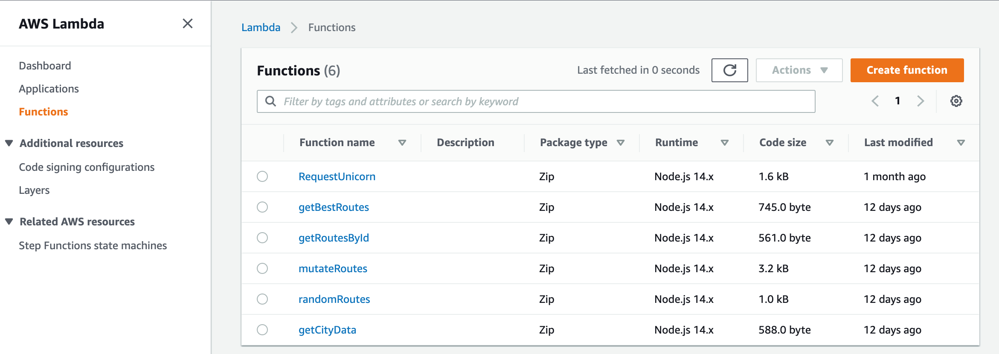
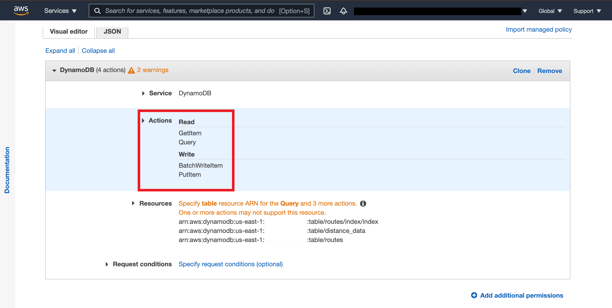

# [Programming for Cloud Computing]: EvoTSP Final Project

- [Overview: Purpose](#purpose)
- [Overview: Solution](#solution)
- [Instructions](#instructions)
- [Technical Details](#technicaldetails)
    - [API details:](#apidetails)
        - [/best](#best)
        - [/city-data](#citydata)
        - [/mutateroute](#mutateroute)
        - [/routes](#routes)
        - [/{routeId}](#routeid)
    - [Lambdas](#lambdas)
        - [getBestRoutes()](#getbestroutes)
        - [getRoutesById()](#getroutesbyid)
        - [randomRoutes()](#randomroutes)
        - [mutateRoutes()](#mutateroutes)
        - [getCityData()](#getcitydata)
    - [IAM Roles](#iamroles)
    - [DynamoDB Table Structures:](#tables)
        - [distance_data](#distancedata)
        - [routes](#routes)
- [Leaflet](#leaflet)
- [Appendix](#Appendix)

<h1 id="purpose">Overview: Purpose </h1>

In general, the Travelling Salesman Problem, or TSP, asks to find the shortest possible route that visits n number of cities exactly once and returns to the starting point. The
purpose of the problem is to find the shortest possible route to minimize the distance traveled. It is a classic optimization problem within the field of operational research, but which also has many possible implications in computer science.

The following application is meant to solve Travelling Salesman Problem using
evolutionary computations. As for key components of this project, we were using
Amazon Web Services infrastructure and features, including Lambdas.

<h1 id="solution">Overview: Solution </h1>

At the very beginning, the application creates a starter population. The general solution
would be to choose a first location as the starting and ending points, create
permutations of other locations, and then return the shortest permutation. Before an
application starts computations, a user may select a specific population size. One of the
Lambdas in AWS, getBestRoutes(), helps us to find the best routes of the initial
population, which serve as “parents.” Another Lambda, mutateRoutes(), creates
children of parent’s routes to find a new best route. Through repeating this process, the
best route gets selected and then is displayed on the map.

<h1 id="instructions">Instructions on how to use:</h1>

By default, our application already has some of the necessary variables, with which a
user may start evolving routes and creating a map. One of the default variables is the
population size which is 100 and refers to the initial population. Another default variable
is noted as “number of parents to keep” that is initially 20. The last default variable of
also 20, is “how many generations to run?”and limits our preferred number generations.
A user may press the “Run evolution” button to start map generating best routes. Once
the best route is selected, a pop up message will appear, together with a final route
shown on the map, and specific details at the bottom of the web application. For
illustration, please refer to the videos below.

Continuation:

<h1 id="technicaldetails">Technical details:</h1>

## API details:

### **/best**

Best resource contains the GET method, is connected to getBestRoutes() lambda
function, and will return the number of shortest routes.

### **/city-data**

City-data resource also takes the GET request and is connected to the getCityData()
lambda function. This delivers city data for the preferred location, which in our case is
the state of Minnesota.

### **/mutateroute**

Mutateroute resource contains the POST method and connects us to the main part of
the application, the mutateRoutes() lambda.

### **/routes**
Routes resource includes the GET method and establishes a connection between our
API Gateway and the randomRoutes() lambda function.

### **/{routeId}**
RouteId is a sub-resource that goes under /routes resource, has a GET method, and
will return a route ID

## Lambdas:

There were used five AWS Lambdas for this project:

### **getBestRoutes()**

Takes GET method and outputs the number of shortest routes. In general, it generate K
best values using a query with “#” marker to create the partition key for the query.

### **getRoutesById**

This lambda takes the requested routeId path and matches it with routeId from “routes”
DynamoDB table. It also returns other information relevant to the database, including
distance, route, and ID.

### **randomRoutes()**

The purpose of randomRoutes() lambda is to generate random routes that are taken
from the “distance_table” DynamoDB table (Minnesota JSON) and calculate the
distance of those routes.

### **mutateRoutes()**

This lambda is the main part of the project and consists of many functions, which as a
result generate new child routes by mutating existing parent routes. It takes a parent
route specified by a routeId and generates several child routes. An overview of this
lambda is to extract routeId and numChildren using a POST request from the body, get
the city-distance data, receive details of the route with the given routeId, record them to
database, and return children. The shortest route will be at the beginning of an array
because they are sorted by length.

### **getCityData()**

getCityData() responds to GET requests and returns the cities component of the
city-distance data object from the “Minnesota” region. The outputs will be
necessary to illustrate routes on the map.

<h1 id="iamroles">IAM roles: </h1>

With IAM roles, we are able to give permission for AWS to access our lambda functions.
For this project, we have used EvoTSPLambda role 2 write and 2 read permissions
within access of DynamoDB tables and indexes.

<h1 id="tables">DynamnoDB Table Structures: </h1>

### **distance_data**

This table includes the region(String) as a partition key (no secondary index or sorting)
that holds the state name, cities that hold information on city objects such as
coordinates, and distances that hold information about length between cities.

### **routes**

Routes table include the routeId(String) as a partition key, with an index that has
runGen(String) as a secondary index, and len(Number) as sorting. Because routeId is
presumably unique for every route, we want to efficiently access elements in the
database, and thus we are using length to get the best routes with the shortest length.

<h1 id="leaflet">Leaflet </h1>

Leaflet is a JavaScript library for interactive maps that allows us to illustrate our desired
maps. For this project, we have used mapBox as a tile provider, and the purpose of
leaflet was to illustrate performing and final routes on the map while computations are
running.