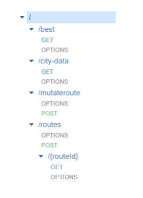

# [Programming for Cloud Computing]: EvoTSP Final Project

- [Overview: Purpose](#purpose)
- [Overview: Solution](#solution)
- [Instructions](#instructions)
- [Technical Details](#technicaldetails)
    - [API details:](#apidetails)
        - [/best](#best)
        - [/city-data](#citydata)
        - [/mutateroute](#mutateroute)
        - [/routes](#routes)
        - [/{routeId}](#routeid)
    - [Lambdas](#lambdas)
        - [getBestRoutes()](#getbestroutes)
        - [getRoutesById()](#getroutesbyid)
        - [randomRoutes()](#randomroutes)
        - [mutateRoutes()](#mutateroutes)
        - [getCityData()](#getcitydata)
    - [IAM Roles](#iamroles)
    - [DynamoDB Table Structures:](#tables)
        - [distance_data](#distancedata)
        - [routes](#routes)
- [Leaflet](#leaflet)
- [Appendix](#appendix)
    - [Lambda functions](#lambdas)
        - [getBestRoutes()](#getbestroutes())
        - [getRoutesById()](#getroutesbyid())
        - [randomRoutes()](#randomroutes())
        - [mutateRoutes()](#mutateroutes())
        - [getCityData()](#getcitydata())
    - [Application components:](#application)
        - [Javascript](#javascript)
        - [HTML](#html)


<h1 id="purpose">Overview: Purpose </h1>

In general, the `Travelling Salesman Problem`, or TSP, asks to find the shortest possible route that visits n number of cities exactly once and returns to the starting point. The
purpose of the problem is to find the shortest possible route to minimize the distance traveled. It is a classic optimization problem within the field of operational research, but which also has many possible implications in computer science.

The following application is meant to solve Travelling Salesman Problem using
evolutionary computations. As for key components of this project, we were using
Amazon Web Services infrastructure and features, including Lambdas.

<h1 id="solution">Overview: Solution </h1>

At the very beginning, the application creates a starter population. The general solution
would be to choose a first location as the starting and ending points, create
permutations of other locations, and then return the shortest permutation. Before an
application starts computations, a user may select a specific population size. One of the
Lambdas in AWS, getBestRoutes(), helps us to find the best routes of the initial
population, which serve as “parents.” Another Lambda, mutateRoutes(), creates
children of parent’s routes to find a new best route. Through repeating this process, the
best route gets selected and then is displayed on the map.

<h1 id="instructions">Instructions on how to use:</h1>

By default, our application already has some of the necessary variables, with which a
user may start evolving routes and creating a map. One of the default variables is the
population size which is 100 and refers to the initial population. Another default variable
is noted as “number of parents to keep” that is initially 20. The last default variable of
also 20, is “how many generations to run?”and limits our preferred number generations.
A user may press the “Run evolution” button to start map generating best routes. Once
the best route is selected, a pop up message will appear, together with a final route
shown on the map, and specific details at the bottom of the web application. For
illustration, please refer to the videos below.


Continuation:


<h1 id="technicaldetails">Technical details:</h1>

## API details:



### **`/best`**

Best resource contains the GET method, is connected to getBestRoutes() lambda
function, and will return the number of shortest routes.

### **`/city-data`**

City-data resource also takes the GET request and is connected to the getCityData()
lambda function. This delivers city data for the preferred location, which in our case is
the state of Minnesota.

### **`/mutateroute`**

Mutateroute resource contains the POST method and connects us to the main part of
the application, the mutateRoutes() lambda.

### **`/routes`**
Routes resource includes the GET method and establishes a connection between our
API Gateway and the randomRoutes() lambda function.

### **`/{routeId}`**
RouteId is a sub-resource that goes under /routes resource, has a GET method, and
will return a route ID

## Lambdas:


There were used five AWS Lambdas for this project:

### **`getBestRoutes()`**

Takes GET method and outputs the number of shortest routes. In general, it generate K
best values using a query with “#” marker to create the partition key for the query.

### **`getRoutesById`**

This lambda takes the requested routeId path and matches it with routeId from “routes”
DynamoDB table. It also returns other information relevant to the database, including
distance, route, and ID.

### **`randomRoutes()`**

The purpose of randomRoutes() lambda is to generate random routes that are taken
from the “distance_table” DynamoDB table (Minnesota JSON) and calculate the
distance of those routes.

### **`mutateRoutes()`**

This lambda is the main part of the project and consists of many functions, which as a
result generate new child routes by mutating existing parent routes. It takes a parent
route specified by a routeId and generates several child routes. An overview of this
lambda is to extract routeId and numChildren using a POST request from the body, get
the city-distance data, receive details of the route with the given routeId, record them to
database, and return children. The shortest route will be at the beginning of an array
because they are sorted by length.

### **`getCityData()`**

getCityData() responds to GET requests and returns the cities component of the
city-distance data object from the “Minnesota” region. The outputs will be
necessary to illustrate routes on the map.

<h1 id="iamroles">IAM roles: </h1>


With IAM roles, we are able to give permission for AWS to access our lambda functions.
For this project, we have used EvoTSPLambda role 2 write and 2 read permissions
within access of DynamoDB tables and indexes.

<h1 id="tables">DynamnoDB Table Structures: </h1>

### **`distance_data`**

This table includes the region(String) as a partition key (no secondary index or sorting)
that holds the state name, cities that hold information on city objects such as
coordinates, and distances that hold information about length between cities.

### **`routes`**

Routes table include the routeId(String) as a partition key, with an index that has
runGen(String) as a secondary index, and len(Number) as sorting. Because routeId is
presumably unique for every route, we want to efficiently access elements in the
database, and thus we are using length to get the best routes with the shortest length.

<h1 id="leaflet">Leaflet </h1>

`Leaflet` is a JavaScript library for interactive maps that allows us to illustrate our desired
maps. For this project, we have used mapBox as a tile provider, and the purpose of
leaflet was to illustrate performing and final routes on the map while computations are
running.

<h1 id="appendix">Appendix </h1>

<h2 id="lambdas">Lambda functions: </h2>

<h3 id="getBestRoutes()"> - getBestRoutes() </h3>


```js
const AWS = require('aws-sdk');
const ddb = new AWS.DynamoDB.DocumentClient();
exports.handler = (event, context, callback) => {
  const queryStringParameters = event.queryStringParameters;
  const runId = queryStringParameters.runId;
  const generation = queryStringParameters.generation;
  const numToReturn = queryStringParameters.numToReturn;
  getBestRoutes(runId, generation, numToReturn)
    .then(dbResults => {
      const bestRoutes = dbResults.Items;
      console.log(bestRoutes);
      callback(null, {
        statusCode: 201,
        body: JSON.stringify(bestRoutes),
        headers: {
          'Access-Control-Allow-Origin': '*'
        }
      });
    })
    .catch(err => {
      console.error(err);
      errorResponse(err.message, context.awsRequestId, callback);
    });
};
function getBestRoutes(runId, generation, numToReturn) {
  const runGen = runId + "#" + generation;
  return ddb.query({
    TableName: 'routes',
    IndexName: 'index',
    ProjectionExpression: "routeId, len",
    KeyConditionExpression: "runGen = :runGen",
    ExpressionAttributeValues: {
      ":runGen": runGen,
    },
    Limit: numToReturn
  }).promise();
}
function errorResponse(errorMessage, awsRequestId, callback) {
  callback(null, {
    statusCode: 500,
    body: JSON.stringify({
      Error: errorMessage,
      Reference: awsRequestId,
    }),
    headers: {
      'Access-Control-Allow-Origin': '*',
    },
  });
}
```

<h3 id="getroutesbyid()">- getRoutesById() </h3>

```js
const AWS = require('aws-sdk');
const ddb = new AWS.DynamoDB.DocumentClient();
exports.handler = (event, context, callback) => {
  const iRouteId = event.pathParameters.routeId;
  
  getRouteById(iRouteId)
    .then(dbResults => {
      callback(null, {
        statusCode: 201,
        body: JSON.stringify(dbResults.Item),
        headers: {
          'Access-Control-Allow-Origin': '*'
        }
      });
    })
    .catch(err => {
      console.error(err);
      errorResponse(err.message, context.awsRequestId, callback);
    });
}
function getRouteById(iRouteId) {
  return ddb.get({
    TableName: 'routes',
    Key: {"routeId": iRouteId},
  }).promise();
}
function errorResponse(errorMessage, awsRequestId, callback) {
  callback(null, {
    statusCode: 500,
    body: JSON.stringify({
      Error: errorMessage,
      Reference: awsRequestId,
    }),
    headers: {
      'Access-Control-Allow-Origin': '*',
    },
  });
}

```

<h3 id="randomroutes()">- randomRoutes() </h3>

```js
const AWS = require('aws-sdk');
const ddb = new AWS.DynamoDB.DocumentClient();
const randomBytes = require('crypto').randomBytes;
exports.handler = (event, context, callback) => {
    const requestBody = JSON.parse(event.body);
    const runId = requestBody.runId;
    getDistanceInfo().then(dbResults => {
        const { distances, cities } = dbResults.Item;
        const routes = cities.map(cities => cities.index);
        const routeId = toUrlString(randomBytes(16));
        shuffle(routes);
        const len = calcLength(routes, distances);
        const partitionKey = runId + '#' + requestBody.generation;
        addRoutes(partitionKey, routeId, routes, len)
            .then(() => {
                callback(null, {
                    statusCode: 201,
                    body: JSON.stringify({ routeId: routeId, length: len }),
                    headers: {
                        'Access-Control-Allow-Origin': '*'
                    }
                });
            })
            .catch(err => {
                errorResponse(err.message, context.awsRequestId, callback);
            });
    }).catch(err => {
        errorResponse(err.message, context.awsRequestId, callback);
    });
};
function getDistanceInfo() {
    return ddb.get({
        TableName: 'distance_data',
        Key: { region: 'Minnesota' }
    }).promise();
}
//Reference https://javascript.info/task/shuffle
function shuffle(array) {
    for (let i = array.length - 1; i > 0; i--) {
        let j = Math.floor(Math.random() * (i + 1));
        [array[i], array[j]] = [array[j], array[i]];
    }
}
function calcLength(routes, distance) {
    let distances = 0;
    for (let i = 0; i < routes.length - 1; i++) {
        const now = routes[i];
        const next= routes[i + 1];
        distances= distances+ distance[now][next];
    }
    distances += distance[routes.length - 1][0]
    return distances;
}
function addRoutes(partitionKey, routeId, route, length) {
    return ddb.put({
        TableName: 'routes',
        Item: {
            runGen: partitionKey,
            routeId: routeId,
            route: route,
            len: length
        },
    }).promise();
}
function toUrlString(buffer) {
    return buffer.toString('base64')
        .replace(/\+/g, '-')
        .replace(/\//g, '_')
        .replace(/=/g, '');
}
function errorResponse(errorMessage, awsRequestId, callback) {
    callback(null, {
        statusCode: 500,
        body: JSON.stringify({
            Error: errorMessage,
            Reference: awsRequestId,
        }),
        headers: {
            'Access-Control-Allow-Origin': '*',
        },
    });
}

```

<h3 id="mutateroutes()">- mutateRoutes() </h3>

```js
const AWS = require('aws-sdk');
const ddb = new AWS.DynamoDB.DocumentClient();
const randomBytes = require('crypto').randomBytes;

/*
 * Parts of this are already in working order, and
 * other parts (marked by "FILL THIS IN") need to be
 * done by you.
 *
 * For reference, here's a list of all the functions that
 * you need to complete:
 * - `getDistanceData()`
 * - `getRouteById()`
 * - `generateChildren()`
 * - `addOneToGen()`
 * - `recordChildren()`
 * - `returnChildren`
 * - `computeDistance`
 */

// This will be called in response to a POST request.
// The routeId of the "parent" route will be
// provided in the body, along with the number
// of "children" (mutations) to make.
// Each child will be entered into the database,
// and we'll return an array of JSON objects
// that contain the "child" IDs and the length
// of those routes. To reduce computation on the
// client end, we'll also sort these by length,
// so the "shortest" route will be at the front
// of the return array.
//
// Since all we'll get is the routeId, we'll need
// to first get the full details of the route from
// the DB. This will include the generation, and
// we'll need to add one to that to create the
// generation of all the children.
exports.handler = (event, context, callback) => {
    const requestBody = JSON.parse(event.body);
    const routeId = requestBody.routeId;
    const numChildren = requestBody.numChildren;
    let lengthStoreThreshold = requestBody.lengthStoreThreshold;
    if (lengthStoreThreshold == null) {
        lengthStoreThreshold = Infinity;
    }

    // Batch writes in DynamoDB are restricted to at most 25 writes.
    // Because of that, I'm limiting this Lambda to only only handle
    // at most 25 mutations so that I can write them all to the DB
    // in a single batch write.
    //
    // If that irks you, you could create a function that creates
    // and stores a batch of at most 25, and then call it multiple
    // times to create the requested number of children.
    if (numChildren > 25) {
        errorResponse("You can't generate more than 25 mutations at a time", context.awsRequestId, callback);
        return;
    }

    // Promise.all makes these two requests in parallel, and only returns
    // it's promise when both of them are complete. That is then sent
    // into a `.then()` chain that passes the results of each previous
    // step as the argument to the next step.
    Promise.all([getDistanceData(), getRouteById(routeId)])
        .then(([distanceData, parentRoute]) => generateChildren(distanceData.Item, parentRoute.Item, numChildren))
        .then(children => recordChildren(children, lengthStoreThreshold))
        .then(children => returnChildren(callback, children))
        .catch(err => {
            console.log("Problem mutating given parent route");
            console.error(err);
            errorResponse(err.message, context.awsRequestId, callback);
        });
};

// Get the city-distance object for the region 'Minnesota'.
function getDistanceData() {
    return ddb.get({
        TableName: 'distance_data',
        Key: { region: 'Minnesota' }
    }).promise();
}

// Get the full info for the route with the given ID.
function getRouteById(routeId) {
    return ddb.get({
        TableName: 'routes',
        Key: {
            "routeId": routeId
        },
    }).promise();
}

// Generate an array of new routes, each of which is a mutation
// of the given `parentRoute`. You essentially need to call
// `generateChild` repeatedly (`numChildren` times) and return
// the array of the resulting children. `generateChild` does
// most of the heavy lifting here, and this function should
// be quite short.
function generateChildren(distanceData, parentRoute, numChildren) {
    let children = [];

    for (let i = 0; i < numChildren; i++){
        children.push(generateChild(distanceData, parentRoute));
    }
    return children;
}

// This is complete and you shouldn't need to change it. You
// will need to implement `computeDistance()` and `addOneToGen()`
// to get it to work, though.
function generateChild(distanceData, parentRoute) {
    const oldPath = parentRoute.route;
    const numCities = oldPath.length;
    // These are a pair of random indices into the path s.t.
    // 0<=i<j<=N and j-i>2. The second condition ensures that the
    // length of the "middle section" has length at least 2, so that
    // reversing it actually changes the route.
    const [i, j] = genSwapPoints(numCities);
    // The new "mutated" path is the old path with the "middle section"
    // (`slice(i, j)`) reversed. This implements a very simple TSP mutation
    // technique known as 2-opt (https://en.wikipedia.org/wiki/2-opt).
    const newPath =
        oldPath.slice(0, i)
            .concat(oldPath.slice(i, j).reverse(),
                oldPath.slice(j));
    const len = computeDistance(distanceData.distances, newPath);
    const child = {
        routeId: newId(),
        runGen: addOneToGen(parentRoute.runGen),
        route: newPath,
        len: len,
    };
    return child;
}

// Generate a pair of random indices into the path s.t.
// 0<=i<j<=N and j-i>2. The second condition ensures that the
// length of the "middle section" has length at least 2, so that
// reversing it actually changes the route.
function genSwapPoints(numCities) {
    let i = 0;
    let j = 0;
    while (j-i < 2) {
        i = Math.floor(Math.random() * numCities);
        j = Math.floor(Math.random() * (numCities+1));
    }
    return [i, j];
}

// Take a runId-generation string (`oldRunGen`) and
// return a new runId-generation string
// that has the generation component incremented by
// one. If, for example, we are given 'XYZ#17', we
// should return 'XYZ#18'.
function addOneToGen(oldRunGen) {
    
    const runId = oldRunGen.substring(0, oldRunGen.indexOf("#"));
    const genStr = oldRunGen.substring(oldRunGen.indexOf("#") + 1, oldRunGen.length);
    
    const inc =  Number(genStr) + 1;
    return runId + '#' + inc;
}

// Write all the children whose length
// is less than `lengthStoreThreshold` to the database. We only
// write new routes that are shorter than the threshold as a
// way of reducing the write load on the database, which makes
// it (much) less likely that we'll have writes fail because we've
// exceeded our default (free) provisioning.
function recordChildren(children, lengthStoreThreshold) {
    
    const childrenToWrite
        = children.filter(child => child.len < lengthStoreThreshold);
    
     let child ={};
    child.RequestItems={};
    child.RequestItems.routes =[];
    
    for (let i = 0; i < childrenToWrite.length; i++){
    
        child.RequestItems['routes'].push({
            PutRequest: { Item: childrenToWrite[i] },
        });
    }
    
    ddb.batchWrite(child, function(err, data) {
        if (err) console.log(err);
        else console.log(data);
    });
    return childrenToWrite;
}

// Take the children that were good (short) enough to be written
// to the database.
//
//   * You should "simplify" each child, converting it to a new
//     JSON object that only contains the `routeId` and `len` fields.
//   * You should sort the simplified children by length, so the
//     shortest is at the front of the array.
//   * Use `callback` to "return" that array of children as the
//     the result of this Lambda call, with status code 201 and
//     the 'Access-Control-Allow-Origin' line.
function returnChildren(callback, children) {
    let shCh = [];
    let simCh = {};
    
    for (let i = 0; i < children.length; i++) {
        
        simCh.routeId = children[i].routeId;
        simCh.len = children[i].len;
        shCh.push(simCh);
    }
    shCh.sort((x, y) => { 
        return x.len - y.len 
        
    });
    callback(null, {
            statusCode: 201,
            body: JSON.stringify(shCh),
            headers: {
                'Access-Control-Allow-Origin': '*'
        }
    });
}

function computeDistance(distances, route) {
    let totalLength = 0;
    for (let i = 0; i < route.length; i++){
        if (i == route.length-1){
            totalLength = totalLength + distances[route[i]][route[0]];
        } else {
            totalLength = totalLength + distances[route[i]][route[i+1]];
        }
    } return totalLength;
}

function newId() {
    return toUrlString(randomBytes(16));
}

function toUrlString(buffer) {
    return buffer.toString('base64')
        .replace(/\+/g, '-')
        .replace(/\//g, '_')
        .replace(/=/g, '');
}

function errorResponse(errorMessage, awsRequestId, callback) {
    callback(null, {
        statusCode: 500,
        body: JSON.stringify({
            Error: errorMessage,
            Reference: awsRequestId,
        }),
        headers: {
            'Access-Control-Allow-Origin': '*',
        },
    });
}
```

<h3 id="getcitydata()">- getCityData() </h3>

```js
const AWS = require('aws-sdk');
const ddb = new AWS.DynamoDB.DocumentClient();
exports.handler = (event, context, callback) => {
    getCityData()
        .then(dbResults => {
            callback(null, {
                statusCode: 201,
                body: JSON.stringify(dbResults.Item.cities),
                headers: {
                    'Access-Control-Allow-Origin': '*'
                }
            });
        })
        .catch(err => {
            console.log(`Problem getting information from "city-data"`);
            console.error(err);
            errorResponse(err.message, context.awsRequestId, callback);
        });
}
function getCityData() {
    return ddb.get({
        TableName: 'distance_data',
        Key: { region: 'Minnesota' },
    }).promise();
}
function errorResponse(errorMessage, awsRequestId, callback) {
    callback(null, {
        statusCode: 500,
        body: JSON.stringify({
            Error: errorMessage,
            Reference: awsRequestId,
        }),
        headers: {
            'Access-Control-Allow-Origin': '*',
        },
    });
}
```


